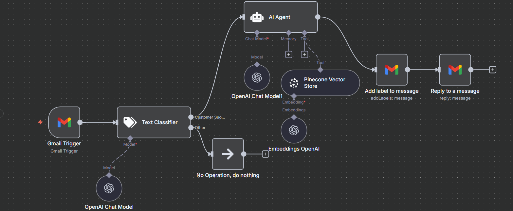

# 2.-Customer-Support-Automated-Email-Workflow-

This repository contains an **n8n workflow** that automates customer email handling for **Tech Heaven Solutions**.  
The workflow classifies incoming emails, fetches relevant knowledge base information, and sends friendly automated replies.  

> ⚠️ Note: The name **Tech Heaven Solutions** is used only as a dummy company for demonstration purposes.  
> You can replace it with your own organization name when deploying this workflow.

---

## 🚀 Workflow Overview

- **Trigger**: `Gmail Trigger` → Listens for incoming customer emails.  
- **Classification**: `Text Classifier` (via OpenAI Chat Model) → Determines if the email is customer support-related.  
- **AI Agent**:  
  - If related to support, passes the query to the AI Agent.  
  - Uses **Pinecone Vector Store** + **OpenAI Embeddings** for context-aware responses.  
- **Response**:  
  - Adds a label to the email (tracking).  
  - Sends an automated reply to the customer.  
- **Fallback**: Non-support emails are ignored (`No Operation`).  

---

## 🛠 Workflow Diagram

---

## 📂 Files in Repo

- `workflow/Customer-Support-Email-Workflow.json` → Exported n8n workflow file.  
- `workflow/workflow-screenshot.png` → Visual diagram of the workflow.  

---

## 🔄 Importing the Workflow in n8n

1. Open **n8n editor**.  
2. Click **Import from File**.  
3. Select `workflow/Customer-Support-Email-Workflow.json`.  
4. Update your Gmail & OpenAI credentials.  

---

## ✅ Features

- AI-powered email classification 🤖  
- Knowledge-base retrieval with Pinecone 📚  
- Automated professional replies with emojis ✨  
- Gmail integration for seamless customer support 📩  

---

---

## 🗂 Email Classification Categories

The **Text Classifier** node is used to decide how an incoming email should be processed.  

### Categories Defined:

1. **Customer Support** 🛠  
   - **Description:** An email related to helping out a customer.  
   - Example:  
     - Asking about company policies.  
     - Questions about services or products.  
     - Requests for assistance or troubleshooting.  

2. **Other** 📂  
   - **Description:** Any email that is **not** related to customer support.  
   - Example:  
     - Newsletters.  
     - Marketing emails.  
     - Non-support-related communication.  

➡️ Only emails classified under **Customer Support** are processed by the AI Agent.  
➡️ Emails classified under **Other** are ignored using the `No Operation` node.  

## 📝 System Message for AI Agent

You are a customer support agent for Tech Heaven Solutions. Your role is to respond to incoming emails with accurate and helpful information using the company knowledge base.

Instructions:

Always maintain a friendly and professional tone. 😊

Use appropriate emojis to make the message engaging.

Provide clear, concise, and relevant answers to customer queries.

Sign off every response as:

“Mr. Helpful, Tech Heaven Solutions”

# output 
- Output only the body content of the email

- 
## 📂 Files in Repo

- [Workflow JSON](./2.Custom%20Support%20wrokflow.json) → Exported n8n workflow file.  
- [Output.pdf](./Output.pdf) → Sample output file showing how the workflow responds.  
- [Screenshot.png](./Screenshot.png) → Visual diagram of the workflow.  
- [README.md](./README.md) → Documentation of this repository.  

How to Use This n8n Workflow

Follow these steps to import and use the workflow JSON file in n8n:

Step 1: Open n8n

Log in to your n8n account (either self-hosted or cloud).

Step 2: Go to Workflows

On the left sidebar, click Workflows.

Step 3: Import Workflow

At the top-right corner, click the three dots (⋮) menu.

Select Import from File.

Step 4: Upload JSON File

Choose the JSON file you downloaded from this repository.

Click Open.

Step 5: Save the Workflow

Once the workflow is loaded, click Save.

Step 6: Run the Workflow

You can now click ▶ Execute Workflow to test it.

✅ That’s it! You have successfully imported and can now use the workflow.
